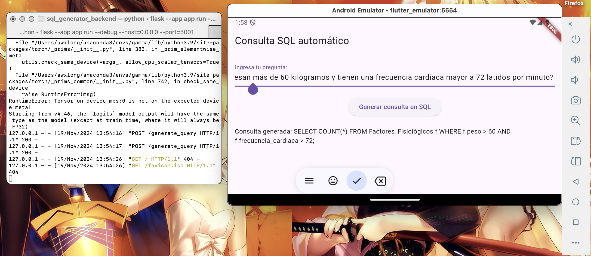

# SQL AI APP

Text-to-SQL in the medical domain is a task which converts natural language text to its corresponding SQL syntax. This is aimed at increasing accessibility for medical personnel who is not familiar with SQL syntax, but needs to query a structured database.

This is an app built written in Dart which queries a text-to-SQL model, [sqlcoder-7b](https://huggingface.co/defog/sqlcoder-7b-2). Dart allows for cross-platform (IOS and Android) compilation. The code is written with perplexity.AI's help 😊. 

Screenshot: 

sqlcoder-7b is multilingual. The above query is in Spanish and asks "How many patients weigh more than 60 kilograms and have a heart rate greater than 72 beats per minute?"

To run it, please:
1. `pip install -r sql_generator_backend/requirements.txt` 
2. Run the backend which initializes sqlcoder-7b using the command `flask --app app run --debug --host=0.0.0.0 --port=5001`
3. Inside `lib/main.dart`, you can select a virtual device and run the app, and make natural language queries. Feel free to modify the database schema in `sql_generator_backend/app.py` according to your needs. 

# Future updates
- Currently, inference takes very long (~3 mins), so we need to optimize throughput. (If possible, the text-to-SQL backend model should be BERT-based so it can compile to Tensorflow Lite).
- We also plan to be able to parse and execute the SQL command on an external database

## Tutorial on getting started with Flutter

A few resources to get you started if this is your first Flutter project:

- [Lab: Write your first Flutter app](https://docs.flutter.dev/get-started/codelab)
- [Cookbook: Useful Flutter samples](https://docs.flutter.dev/cookbook)

For help getting started with Flutter development, view the
[online documentation](https://docs.flutter.dev/), which offers tutorials,
samples, guidance on mobile development, and a full API reference.
